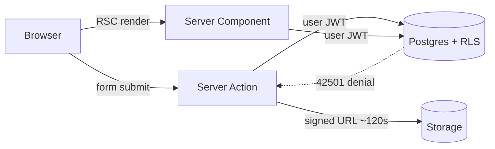

# תכנון ארכיטקטורת התוכנה — PayrollPortal

מסמך זה עונה על סעיף 3 בתרגיל (מבנה המערכת ברמה טכנית).
פירוט סכימה, RLS, Actions ו-UX נמצא ב-[technical-design/](technical-design/).

---

## 1. רכיבי המערכת

```
┌─────────────┐     HTTPS      ┌──────────────────────┐
│   Browser   │ ─────────────► │  Next.js on Vercel   │
│  (React 19) │                │  App Router          │
└─────────────┘                │                      │
                               │  Server Components   │── קריאות קריאה
                               │  Server Actions      │── כתיבות
                               │  Route Handlers      │── קבצים / callback
                               └──────────┬───────────┘
                                          │ JWT של המשתמש (anon key)
                                          ▼
                               ┌──────────────────────┐
                               │  Supabase            │
                               │  Auth + Postgres     │
                               │  Storage (private)   │
                               │  RLS על כל טבלה      │
                               └──────────────────────┘
```

| רכיב | תפקיד |
| --- | --- |
| **Next.js 16 (App Router)** | UI, ניתוב, Server Components לקריאה, Server Actions לכתיבה |
| **TypeScript** | טיפוסים ב-`types/app.ts` ובגבול ה-Action |
| **Supabase Auth** | זהות: סיסמה + magic link; `auth.uid()` הוא מה ש-RLS קורא |
| **Supabase Postgres** | כל הנתונים העסקיים; RLS הוא גבול ההרשאות |
| **Supabase Storage** | באקטים פרטיים: `payslips`, `documents`, `time_off` |
| **Vercel** | אירוח האפליקציה; דרישת הקורס |
| **Zod** | ולידציה בגבול כל Action |
| **pdf-parse / pdf2json** | פענוח תלוש בשרת בלבד |

אין REST CRUD ציבורי. הדפדפן לא מדבר עם PostgREST ישירות בשביל משכורות: הקריאות עוברות דרך שרת Next עם לקוח שמחזיק את ה-JWT של המשתמש. מפתח `service_role` **לא נמצא בקוד**.

החלטה מרכזית: **RLS הוא גבול ההרשאה.** גם אם כל ה-TypeScript יוחלף בחיבור Postgres עם JWT של עובד, העובד עדיין לא יקרא משכורת של מישהו אחר.



---

## 2. מסד נתונים

כן. Postgres על Supabase. הסכימה חיה ב-`supabase/migrations/` (0001–0012).

### ישויות מרכזיות

| טבלה | מה היא |
| --- | --- |
| `profiles` | אדם אחד לכל `auth.users` |
| `bookkeeping_firms` / `firm_memberships` | משרד ומנהלי החשבונות שלו |
| `companies` | עסק לקוח (`firm_id`) — ה-tenant |
| `memberships` | תפקיד `employee` / `manager` בחברה; מקור האמת לתפקיד |
| `invitations` | טוקן הצטרפות; רב-פעמי לפי תפקיד, או חד-פעמי |
| `employees` | רשומת HR; `membership_id` יכול להיות null |
| `payroll_periods` | חודש שכר: draft / published / locked |
| `payslips` / `payslip_components` | תלוש; ייחודי `(period_id, employee_id)` |
| `leave_types` / `leave_entitlements` | סוגי חופשה ומכסות |
| `time_off_requests` / `time_off_attachments` | בקשות ואישורים רפואיים |
| `documents` | 106, 101, חוזה, פנסיה, אחר |
| `team_join_requests` | מנהל מבקש, עובד מאשר |
| `company_holidays` | חגים לחישוב ימי עבודה |
| `audit_log` | append-only מתוך RPCs |

`app_role` הוא enum: `'employee' | 'manager' | 'bookkeeper'`.

אין Views של סיכומי שכר ב-SQL. תובנות ויתרות מחושבות ב-TypeScript על שורות שה-RLS כבר סינן.

---

## 3. עמודים באפליקציה

קבוצות ניתוב לפי תפקיד. Layout של כל קבוצה קורא `requireRole`. מנהל מורשה גם בנתיבי עובד.

| אזור | נתיבים |
| --- | --- |
| ציבורי | `/`, `/login`, `/signup`, `/signup/bookkeeper`, `/signup/worker`, `/verify`, `/invite/[token]`, `/no-access` |
| עובד | `/employee`, `/employee/payslips`, `/employee/documents`, `/employee/documents/form-101`, `/employee/time-off` |
| מנהל | `/manager`, `/manager/approvals`, `/manager/team`, `/manager/team/[employeeId]`, `/manager/shared`, `/manager/calendar` |
| משרד | `/bookkeeper`, `/bookkeeper/approvals`, `/bookkeeper/businesses`, `/bookkeeper/businesses/[companyId]`, `/bookkeeper/businesses/[companyId]/employees/[employeeId]`, `/bookkeeper/periods`, `/bookkeeper/periods/[periodId]`, `/bookkeeper/documents` |

`proxy.ts` מרענן את עוגיית הסשן ומפנה אנונימיים ל-`/login`. הוא **לא** מחליט תפקיד — לזה צריך את מסד הנתונים.

---

## 4. API routes ו-Server Actions

אין API CRUD כללי. שלושה מנגנונים:

**Server Components** — כל קריאה שמרנדרת דף (תלושים, יתרות, תורים).

**Server Actions** תחת `lib/actions/`:

| קובץ | פעולות עיקריות |
| --- | --- |
| `auth.ts` | `signIn` |
| `businesses.ts` | יצירת/מחיקת עסק, רשימת עסקי המשרד |
| `invitations.ts` | קישורי הצטרפות, הזמנות חד-פעמיות, סיבוב טוקן |
| `periods.ts` | פתיחת תקופה, פרסום |
| `payslips.ts` | העלאה, שיתוף, URL חתום |
| `parse-payslip.ts` | פענוח בשרת |
| `time-off.ts` | בקשה, ביטול, אישור/דחייה, לוח שנה, תור אישורים |
| `employees.ts` | צירוף לצוות, סיום העסקה, שיוך מנהל, יתרות מתלוש |
| `documents.ts` | העלאה, 101, שיתוף, הורדה |
| `form-101.ts` | שמירת טופס 101 של העובד |

**Route Handlers:**

| נתיב | תפקיד |
| --- | --- |
| `GET /auth/callback` | מחליף קוד Auth בעוגיית סשן |
| `POST /auth/signout` | מנקה סשן |
| `GET /api/payslips/[id]` | הפניה 307 ל-URL חתום |
| `GET /api/documents/[id]` | אותו דבר למסמך |
| `GET /api/time-off/attachments/[id]` | אותו דבר לאישור מחלה |
| `POST /api/payslips/parse` | PDF → פענוח (העלאה מרובה) |

**RPCs ב-Postgres** למכונות מצבים (נעילת שורה + כמה כתיבות בטרנזקציה אחת): `decide_time_off`, `cancel_time_off`, `publish_payroll_period`, `request_direct_report`, `decide_team_join`, `terminate_employee`, ועוד — ראו [03-api.md](technical-design/03-api.md).

---

## 5. זרימת מידע: Frontend → Backend → Database

### קריאת דף (למשל דשבורד עובד)

1. הדפדפן מבקש `/employee`.
2. `proxy.ts` מרענן סשן.
3. Layout קורא `requireWorkspace()` + `requireRole(["employee", "manager"])`.
4. Server Component יוצר לקוח Supabase מהעוגיות (`lib/supabase/server.ts`).
5. השאילתה רצה כ-`auth.uid()` של המשתמש. RLS מחזיר רק שורות מותרות.
6. `buildPayInsights()` רץ בשרת על התוצאה. ה-HTML כולל מספרים; ה-JS של הדפדפן לא מושך משכורות.

### כתיבה (למשל בקשת חופשה)

1. טופס native → Server Action.
2. Zod `safeParse`. כשל → `{ ok: false, fieldErrors }` בלי לכתוב.
3. השרת גוזר `employeeId` ו-`workingDays` בעצמו (לא סומך על הלקוח).
4. INSERT דרך הלקוח עם JWT. RLS דורש שהשורה תהיה של המבקש ובסטטוס `pending`.
5. חפיפה נתפסת ב-EXCLUDE (`23P01`).
6. `revalidatePath` מרענן את הדף.

### קובץ

1. Action בודק הרשאה מול טבלה.
2. מעלה ל-Storage (מדיניות לפי נתיב).
3. הורדה: Action מנפיק signed URL (~120 שניות) ו-Route Handler עושה 307.

הלקוח בדפדפן (`lib/supabase/client.ts`) משמש **רק** לכניסה וליציאה, כי הספרייה צריכה לכתוב עוגייה בעצמה.

---

## 6. משתמשים והרשאות

תפקיד חי בטבלה שאנחנו שולטים בה, לא ב-`user_metadata` (המשתמש יכול לשכתב metadata בעצמו). ראו [for-liad-role-security.md](for-liad-role-security.md).

| יכולת | עובד | מנהל | משרד |
| --- | :---: | :---: | :---: |
| תובנות שכר / תלושים של עצמו | כן | כן | — (לא על מצבת הלקוח) |
| בקשת חופשה / ביטול pending | כן | כן | — |
| העלאת טופס 101 | כן | כן | — |
| רשימת אנשי העסק | לא | כן | כן |
| תלוש של אחר (מטא-דאטה / PDF) | לא | רק אם שותף | כן |
| אישור חופשה (לא של עצמו) | לא | כן, כל העסק | כן, כל לקוח |
| בקשת צירוף לצוות | לא | כן (העובד מאשר) | שיוך ישיר |
| העלאת תלושים / פרסום חודש | לא | לא | כן |
| יצירת עסק / הזמנות / סיום העסקה | לא | לא | כן |

שכבות הגנה:

1. `proxy.ts` — חייבים סשן מחוץ לנתיבים ציבוריים.
2. `requireRole` — UX: מפנה לדף הבית של התפקיד.
3. Server Action — בדיקה לפני כתיבה, הודעת שגיאה ברורה.
4. RLS + RPCs — גבול אמיתי ב-Postgres.

---

## 7. ספריות ושירותים חיצוניים — ולמה

| בחירה | למה זה ולא החלופה |
| --- | --- |
| Next.js App Router | Server Components משאירים שכר בשרת; Actions חוסכים API CRUD ידני |
| TypeScript strict | אותם טיפוסים ב-view-model וב-Action |
| Supabase Postgres + RLS | הרשאה במסד, לא רק ב-middleware |
| Supabase Auth | אותו `auth.uid()` שהמדיניות קוראת |
| Supabase Storage | באקטים פרטיים + מדיניות לפי נתיב + URL חתום |
| Tailwind CSS 4 | עיצוב בבעלותנו, בלי ספריית קומפוננטות |
| Zod | אותה סכימה בתצוגת טופס וב-Action |
| `Intl` + מחרוזות `YYYY-MM-DD` | ימי לוח ב-Asia/Jerusalem בלי ספריית תאריכים |
| pdf-parse / pdf2json | פענוח תלוש ישראלי בשרת; לא בדפדפן |
| Vercel | דרישת הקורס; צמוד ל-Next.js |

מה **לא** שילבנו בכוונה: Redux/Zustand (המידע חי ב-RSC), TanStack Table, toast library, Recharts (גרף SVG פשוט), shadcn, `service_role`, cron לצבירה חודשית.
