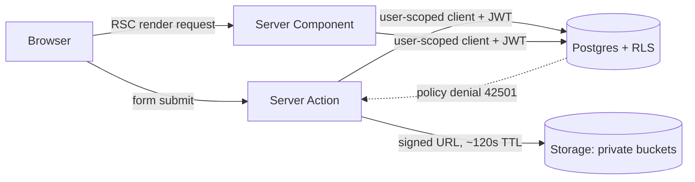

# Technical Design — SMB Payroll & Bookkeeping Portal

> Deliverable #4 ("תכנון טכני מפורט") for RUNI CS 2026 Internet Technologies.
> This set describes the system **as built**. The SQL that actually runs is
> `supabase/migrations/` (0001 through 0012), not the snippets alone.

## Documents in this set

| File | Contents |
| --- | --- |
| `00-overview.md` | Scope, stack, roles, permission model |
| `01-database.md` | Schema, constraints, indexes |
| `02-rls.md` | Row Level Security for the three roles, Storage policies |
| `03-api.md` | Server Actions, Route Handlers, RPCs |
| `04-frontend.md` | Folder structure, components, state, validation, errors |
| `05-business-logic.md` | Salary insights math, leave accounting, state machines |
| `06-ux.md` | Screen-by-screen UX for each role |

---

## 1. Problem and scope

Small and medium businesses in Israel typically outsource payroll to an external
bookkeeper. The result is a document-by-email process: employees WhatsApp the
bookkeeper asking for last year's Form 106, managers approve vacation days in a
spreadsheet, and nobody can answer "how much was deducted from me this year?"
without opening twelve PDFs.

This product gives each SMB one portal with three role-specific views:

- **Employee** — salary insights, leave balance, download pay slips and forms,
  submit time-off, upload Form 101.
- **Manager** — the same personal workspace, plus team overview, leave
  approvals for people at the business, a calendar of who is away, and files
  explicitly shared with managers.
- **Bookkeeper** — a bookkeeping *firm* that owns several client companies:
  upload and parse pay slips, publish months, file HR documents, invite staff,
  and approve leave when a line manager is missing.

### Explicitly out of scope (v1)

Running payroll calculations, bank/tax-authority integrations, payments,
multi-level approval chains, org-chart editing, mobile apps, email
notifications, and automated monthly leave accrual. We store and present
payroll data produced elsewhere; we do not compute gross-to-net. PDF parse
*suggests* numbers and an employee match; a human still confirms assignment.

---

## 2. Stack and rationale

| Concern | Choice | Why this and not the alternative |
| --- | --- | --- |
| Framework | Next.js 16, App Router | Server Components keep payroll data server-side by default; Server Actions avoid a hand-written CRUD API |
| Language | TypeScript (strict) | View-model types in `types/app.ts`; Zod at the action boundary |
| Database | Supabase Postgres | RLS pushes authorization into the database |
| Auth | Supabase Auth (password + magic link) | Same `auth.uid()` that RLS policies read |
| Files | Supabase Storage (private buckets) | Path-based RLS; short-lived signed URLs |
| Styling | Tailwind CSS 4 | Utility classes we own; no component library |
| Forms | Native forms + Zod | Same schema on the client preview and inside the Server Action |
| Dates | `Intl` + ISO `YYYY-MM-DD` in `lib/domain/working-days.ts` | Asia/Jerusalem calendar days without a date library |
| Hosting | Vercel | Assignment requirement; co-located with Next.js |

### Key architectural decision: RLS is the authorization boundary

Every read goes through a Supabase client that carries the user's JWT, so
Postgres decides what rows come back. Server Actions add a second check before
writing (fail fast with a good error message), but they are *not* the only line
of defense. The `service_role` key is **not used** in this codebase. Invites
are ordinary `invitations` rows plus an `auth.users` trigger; there is no
accrual cron.



---

## 3. Tenancy and roles

A person is one `auth.users` row and one `profiles` row globally.

- **Employees and managers** get a `memberships` row per company, with
  `role` as a Postgres enum. The role is taken from the **invitation token**,
  never from `user_metadata` (see `docs/for-liad-role-security.md`).
- **Bookkeepers** belong to a `bookkeeping_firms` row via `firm_memberships`.
  They are usually *not* on a client payroll, so they do not get the employee
  nav. Client companies hang off `companies.firm_id`.
- A manager is also an employee of that company: they see their own salary
  under `/employee` and the team under `/manager`.
- Revoking access is `is_active = false` on a membership, not a cascade of
  deletes. Terminating a person sets `employees.status = 'terminated'` so pay
  history survives.

```sql
create type app_role as enum ('employee', 'manager', 'bookkeeper');
```

### Permission matrix

| Capability | Employee | Manager | Bookkeeper |
| --- | :---: | :---: | :---: |
| Read own profile / salary insights | ✅ | ✅ | — (firm workspace, not a client employee) |
| Download own pay slips and forms | ✅ | ✅ | ✅ (all in companies they manage) |
| Submit time-off request | ✅ | ✅ | — |
| Cancel own *pending* request | ✅ | ✅ | — |
| Upload own Form 101 | ✅ | ✅ | — |
| Read people at the company | ❌ | ✅ (whole company) | ✅ |
| Read published pay slip **metadata** for others | ❌ | ✅ if `visible_to_managers` | ✅ |
| Open others' pay slip **PDFs** | ❌ | ✅ if that file is shared | ✅ |
| Approve / reject time-off | ❌ | ✅ (anyone at the company except themselves) | ✅ (any client company) |
| Ask someone onto their team | ❌ | ✅ (that person must accept) | — |
| Assign a line manager directly | ❌ | ❌ | ✅ |
| Upload / assign / parse pay slips | ❌ | ❌ | ✅ |
| Publish a payroll period | ❌ | ❌ | ✅ |
| Upload HR documents for a person | ❌ | ❌ | ✅ |
| Create a client business, invite staff | ❌ | ❌ | ✅ |
| Terminate a person / remove a business | ❌ | ❌ (can only drop them from *their* team) | ✅ |

Sharing with managers is **per file** (`payslips.visible_to_managers` and
`documents.visible_to_managers`, default on for new uploads). The company flag
`managers_can_view_payslip_files` still exists on `companies` and is set when
the business is created; day-to-day access is the per-file column.

The bookkeeper can *write* payroll and *also* approve leave (so a request is
not stuck when nobody is listed as line manager). The manager can approve leave
and cannot write payroll. Neither role is a superset of the other for
payroll vs HR, which is why a single `is_admin` boolean would not have worked.
