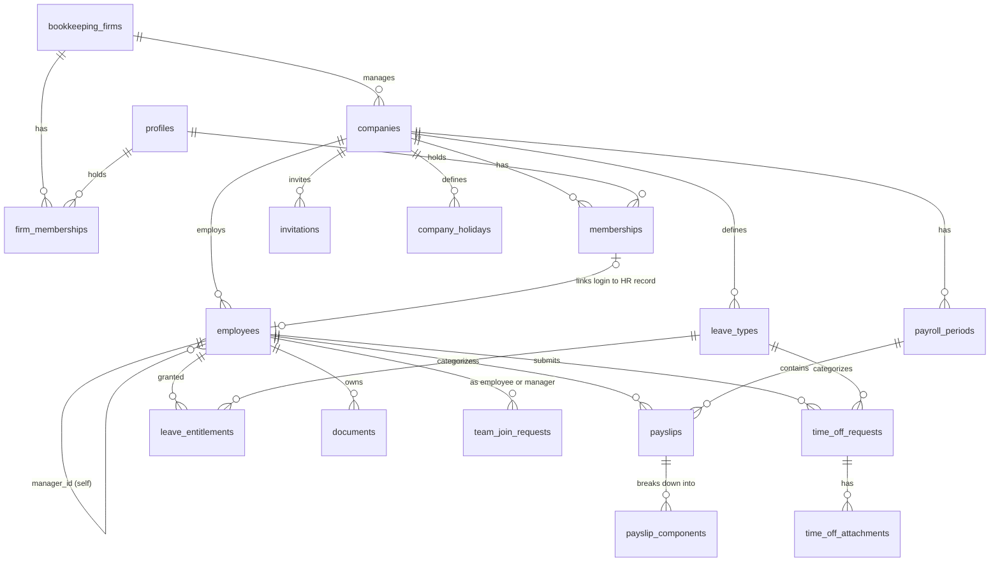

# Database Design

Postgres on Supabase. The schema that actually runs is
`supabase/migrations/` applied in order (`0001` … `0012`). Snippets below
match that tree; if they disagree, the migration file wins.

## 1. Entity relationships



## 2. Migrations after 0001

| File | What it adds |
| --- | --- |
| `0002` | Documents Storage policies |
| `0003` | `visible_to_managers` on documents and payslips; files always filed to one person |
| `0004` | Leave entitlements seed, invite `manager_id` |
| `0005` | `time_off_attachments` + `time_off` bucket |
| `0006` | Company managers (and bookkeepers) can see and decide time-off |
| `0007` | Remove from team, terminate employee, remove company |
| `0008` | Share-with-managers default on; claim-report RPC (later wrapped as a request) |
| `0009` | `time_off_requests.unscheduled` for remaining-day leave |
| `0010` | Employees may insert their own Form 101 |
| `0011` | `team_join_requests` — manager asks, employee accepts |
| `0012` | Two reusable join links per company (employee vs manager); `handle_new_user` takes role from the token |

## 3. Core tables

### `profiles`

One row per login. `id` is `auth.users.id`, filled by `handle_new_user`.
Locale defaults to `en`. Israeli national ID is stored when the person
supplies it at signup (used to match pay slips). `national_id_last4` on
`employees` is derived from the same value.

### `bookkeeping_firms` and `firm_memberships`

A practice that manages many client `companies`. Bookkeeper signup creates
the firm; they are not required to have a `memberships` row at any client.

### `companies`

Tenant. `firm_id` points at the practice. `weekend_days` default `{5,6}`
(Friday, Saturday). `managers_can_view_payslip_files` still exists; per-file
`visible_to_managers` is what the UI toggles.

### `memberships`

Authorization for employees and managers at one company. Unique
`(company_id, profile_id)`. Role is `app_role` and is written from the
invitation, not from the client.

### `invitations`

Employee or manager only (`role in ('employee', 'manager')`). Two kinds:

- **Reusable** — one employee link and one manager link per company
  (`unique (company_id, role) where reusable`). Created when the business is.
- **One-time** — optional email lock, `used_at` after signup.

`handle_new_user` reads `invitation_token` from metadata and copies
`invitations.role` onto the new membership.

### `employees`

HR record. `membership_id` is nullable so a bookkeeper can file a person
before they log in, and so a terminated person keeps pay history after the
login is dropped. `manager_id` is the line manager (same company). Trigram
index on `full_name` for assignment search. `national_id` is used to match
parsed pay slips.

### `payroll_periods` and `payslips`

A month is `draft` until publish. Employees only see `published` slips
(RLS). `numeric(12,2)` for money. Unique `(period_id, employee_id)`.
`visible_to_managers` gates manager reads of *other people's* slips.
`file_checksum` rejects duplicate PDFs.

`payslip_components` still exists; a trigger can recompute parent totals.
The bulk upload path often stores gross/net/deductions on the slip itself
from the parser rather than a full component breakdown.

### Leave

`leave_types` per company (`vacation`, `sick`, …). `leave_entitlements`
stores what is granted for a year. Used and pending days are **derived**
from `time_off_requests` in TypeScript (`listEmployeeLeaveBalances`), not
from a stored counter.

`time_off_requests` carries `start_date`, `end_date`, `working_days`,
`reason`, `status`, and `unscheduled`. Unscheduled rows are "all remaining
days of this type" with no real date range — they are excluded from the
overlap gist and from the manager calendar.

Exclusion constraint (dated requests only):

```sql
alter table time_off_requests
  add constraint no_overlapping_active_leave
  exclude using gist (
    employee_id with =,
    daterange(start_date, end_date, '[]') with &&
  ) where (status in ('pending', 'approved') and not unscheduled);
```

`time_off_attachments` are sick notes (and similar) on a request.

### `documents`

Kinds: `form_106`, `form_101`, `contract`, `pension_report`, `other`.
Always filed to one `employee_id` in the product (company-wide null rows
are unused). `visible_to_managers` is the manager share flag. Employees
may insert only `kind = 'form_101'` for themselves.

### `team_join_requests`

Pending ask from a manager to an employee at the same company. Unique
pending pair `(manager_id, employee_id)`. Status changes go through RPCs
(`request_direct_report`, `decide_team_join`, `cancel_team_join_request`).
Bookkeepers still set `employees.manager_id` directly.

### `company_holidays` and `audit_log`

Holidays feed working-day counts. `audit_log` is append-only; RPCs insert
rows. `authenticated` is not granted insert/update/delete on it.

## 4. Derived data (not SQL views)

The original design used `v_monthly_pay`, `v_salary_stats`, and
`v_leave_balance`. Those views were never created. Dashboards call:

- `buildPayInsights()` in `lib/domain/insights.ts` over published slips
- `listEmployeeLeaveBalances()` over entitlements + requests

Both still subtract pending leave from available days, and both still
refuse a meaningful average until there are enough months.

## 5. Extensions

```sql
create extension if not exists pg_trgm;
create extension if not exists btree_gist;
create extension if not exists citext;
```

There is no generated `types/database.ts`. Application types live in
`types/app.ts` and next to each action file.
