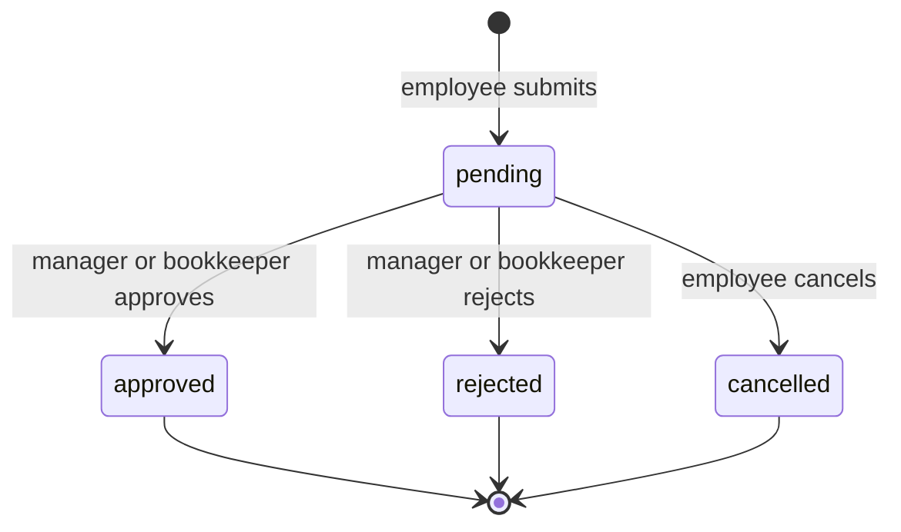
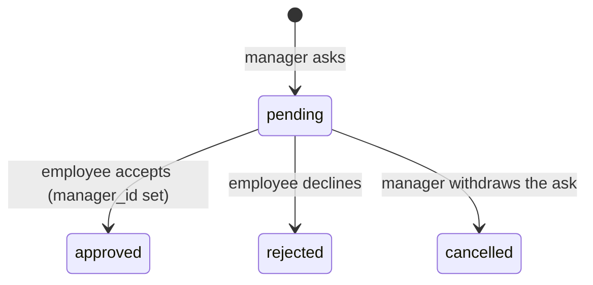
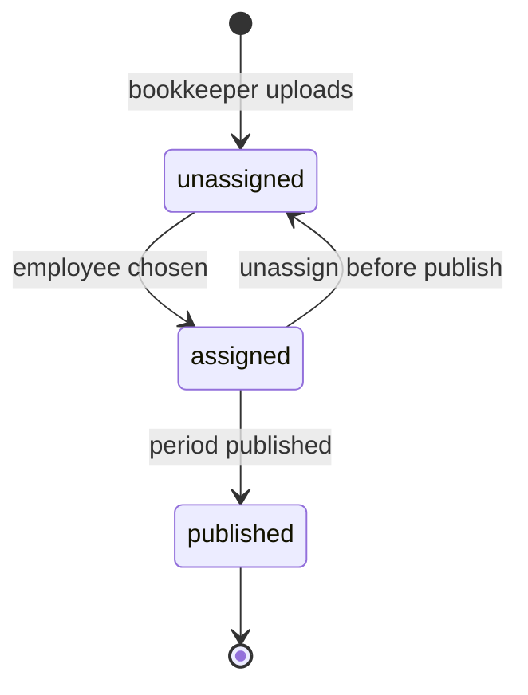

# Core Business Logic

The logic worth documenting is the part where a reasonable person could pick a
different answer. Pure functions live in `lib/domain/`. Payslip text extraction
lives in `lib/payslip/parser.ts` (Liad) and is not rewritten here.

## 1. Salary insights

`buildPayInsights()` in `lib/domain/insights.ts` takes published months only.

### Averages

- **Rolling 12-month average net** — last 12 published periods, not tied to
  January. Shown only when there are **at least 3** months; otherwise the
  UI keeps a dash rather than pretending one month is "typical".
- **Year-to-date** — total and average for the current calendar year.
  YTD average needs at least 2 months in that year.

### Fluctuation

Coefficient of variation of net pay over the same window:

\[ CV = \frac{\sigma_{net}}{\mu_{net}} \]

Sample standard deviation (n − 1). Thresholds:

| CV | Label |
| --- | --- |
| < 0.05 | Stable |
| 0.05 – 0.15 | Some variation |
| > 0.15 | Highly variable |

Month-over-month delta is amount and percent vs the previous published
month, with that month named.

One-off bonus exclusion from the trend was designed; the current trend
uses each month's net as stored. Language in the UI is "deduction rate",
never "tax rate".

### Employer cost

Not shown on the employee dashboard. Team views use latest net and an
average of those nets, not employer cost.

## 2. Working-day calculation

Leave is counted in working days on the server from company weekends and
holidays. Dates are **`YYYY-MM-DD` strings**, never `Date` in local TZ:

```ts
countWorkingDays(start, end, weekendDays, holidays)
```

- Both endpoints inclusive: 3 March → 3 March is one day.
- Full-day holidays count 0; half-day eves count 0.5.
- Weekends are skipped even when a holiday lands on them.
- The form *previews* the count; insert recomputes it.

## 3. Leave accounting

```
available = entitled + carried_over + adjustment − approved − pending
```

1. **Pending consumes balance.**
2. **Cancel and reject** drop out of the sum and out of the overlap
   constraint, so days and dates free in the same transaction.
3. **Unpaid / reserve duty** are separate `leave_types` and do not draw
   vacation when their accrual is zero.
4. **Unscheduled remaining-day leave** stores dummy dates of "today" and
   `unscheduled = true`. Those rows do not occupy the calendar and are
   excluded from the gist overlap. At most one pending unscheduled row
   per `(employee, leave_type)`.
5. **Negative balance** only via bookkeeper `adjustment_days` (or a
   payslip remaining-day write). `submitTimeOffRequest` refuses an
   oversize dated request.

There is **no monthly accrual cron**. New people get entitlement rows from
`seed_leave_entitlements` / `ensure_my_leave_entitlements`. Remaining days
on a pay slip can be copied onto entitlements by the bookkeeper
(`applyPayslipLeaveBalances`). Year-end carryover is not automated.

## 4. State machines

### Time-off request



Terminal states do not mutate. Two clicks serialize on `FOR UPDATE`.

### Team join



Bookkeepers skip this and set `manager_id` directly.

### Pay slip



Unassigned rows are invisible to employees and managers by RLS.

### Payroll period

`draft → published → locked`. Publishing is one RPC. Locked months reject
further writes so a number an employee already saw cannot silently change.

## 5. Pay slip assignment matching

Bulk upload (`SmartBusinessPayslipUpload` + `/api/payslips/parse`):

1. Parse the PDF (employee id, name, period, gross/net/deductions, leave
   remaining).
2. Match `employees.national_id` / `employee_number` in that company.
3. Pre-fill assignment. **Nothing is assigned without a human confirm.**

A wrong assignment shows one employee another's salary — the worst
failure this product can have — so auto-match only suggests.

Duplicates: sha256 on the file, and `unique (period_id, employee_id)`.

## 6. What the bookkeeper may edit

Gross, net, deductions, and leave remaining can be typed or taken from
the parser. Period publish is the wide-blast action and stays behind an
explicit confirm. Removing a person is terminate, not delete. Removing a
business is at the bottom of that business page and is irreversible on
purpose.
